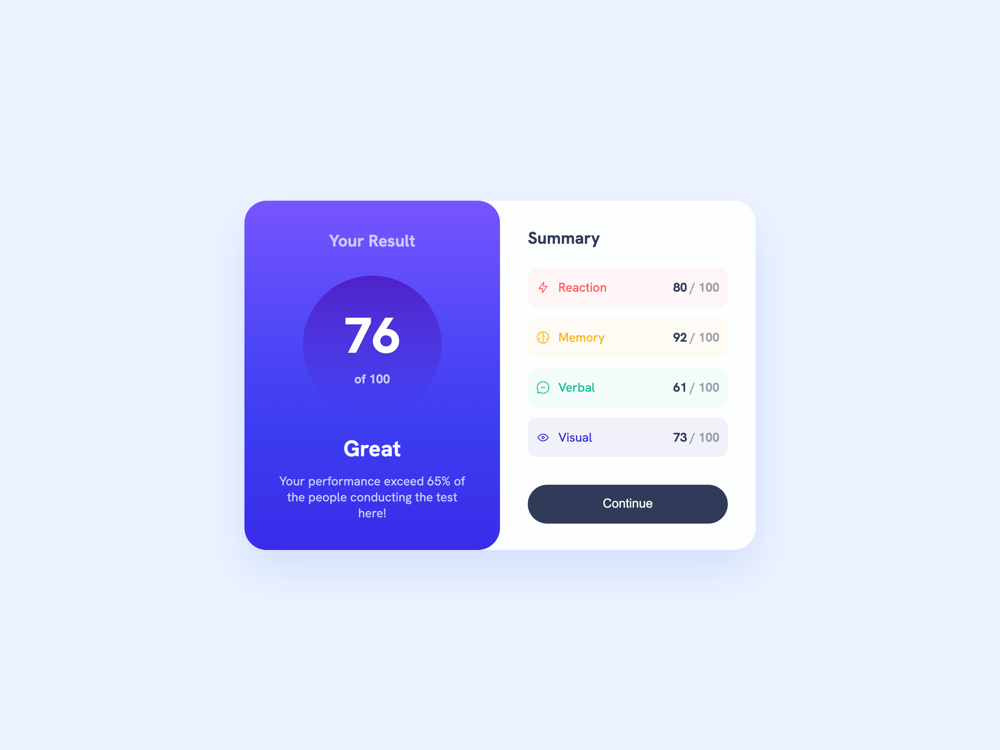

# Frontend Mentor - Results summary component

## Table of contents

- [Overview](#overview)
  - [The challenge](#the-challenge)
  - [Screenshot](#screenshot)
  - [Links](#links)
- [My process](#my-process)
  - [Built with](#built-with)
- [Author](#author)

## Overview

## The challenge

Your users should be able to:

- View the optimal layout for the interface depending on their device's screen size
- See hover and focus states for all interactive elements on the page
- **Bonus**: Use the local JSON data to dynamically populate the content

Want some support on the challenge? [Join our community](https://www.frontendmentor.io/community) and ask questions in the **#help** channel.

### Screenshot

### Links

- Solution URL: [Github](https://github.com/agneslai/front-end-challenges)
- Live Site URL: [Live Site](https://agneslai.github.io/front-end-challenges/results-summary-component)

## My Process
### Built with

- Semantic HTML5 markup
- CSS custom properties
- Flexbox

## Author
- Frontend Mentor - [@agneslai](https://www.frontendmentor.io/profile/agneslai)
